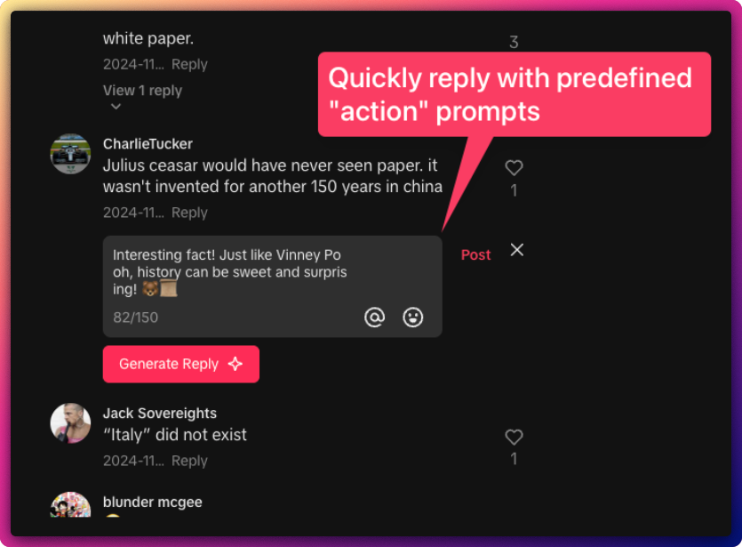
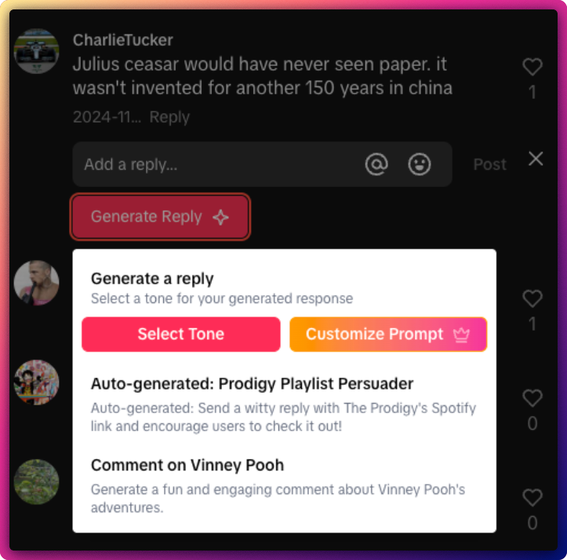
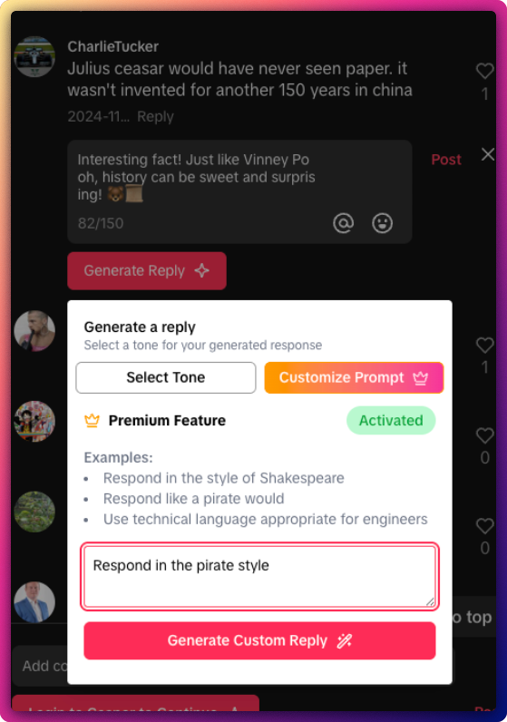
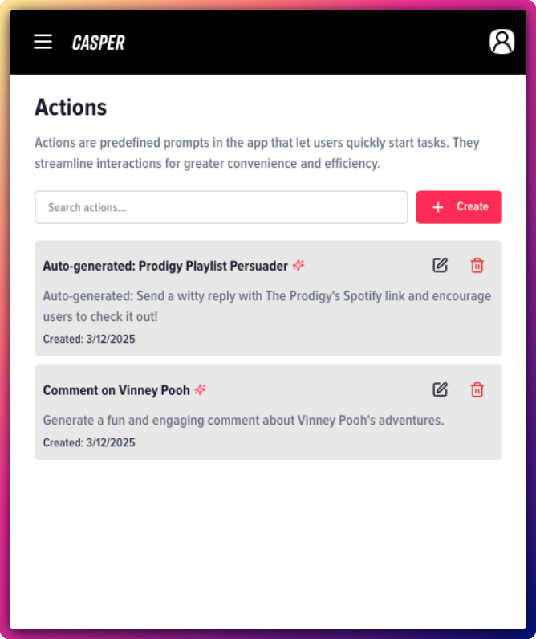
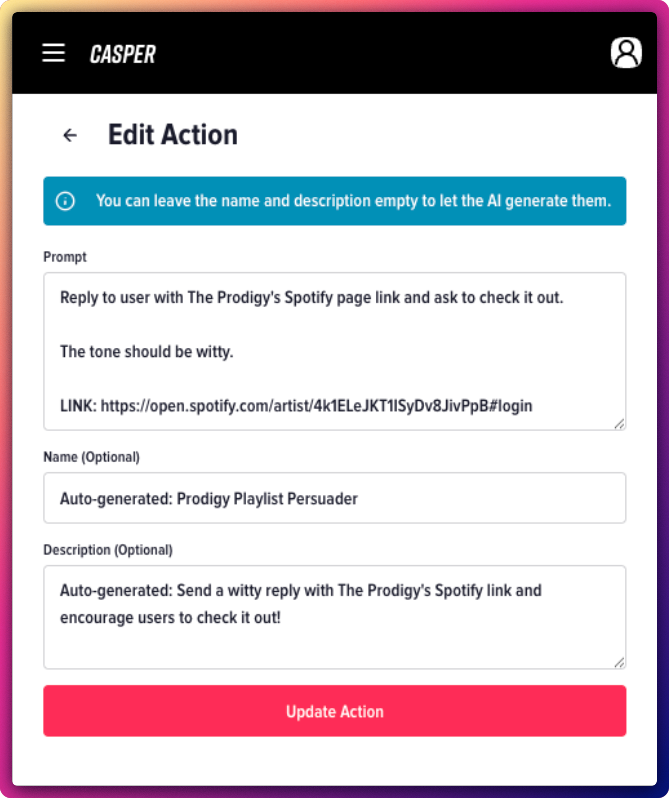

<p align="center">
  
</p>

<h1 align="center">Casper: AI-Powered TikTok Comment Assistant</h1>

<p align="center">
  A browser extension that helps marketing teams and content creators respond to TikTok comments more easily.
</p>

## What is Casper?

Casper is a browser extension that adds an AI-powered comment assistant directly into TikTok's interface. It helps marketing teams, social media managers, and content creators save time by generating thoughtful, on-brand responses to comments with just a few clicks.

<p align="center">
  
</p>

## Features

- **AI-Powered Comment Generation**: Generate contextually relevant responses to TikTok comments
- **Custom Actions**: Create and save your favorite response templates for quick access
- **Custom Prompts**: Craft personalized instructions for the AI to match your brand voice
- **Seamless Integration**: Works directly within TikTok's comment interface
- **User Authentication**: Securely save your preferences across devices

## Screenshots

<p align="center">
  
  <br><em>Select from pre-defined tones for your response</em>
</p>

<p align="center">
  
  <br><em>Create custom prompts for personalized responses</em>
</p>

<p align="center">
  
  <br><em>Manage your saved actions</em>
</p>

<p align="center">
  
  <br><em>Create new custom actions</em>
</p>

## How It Works

1. **Install the extension** from the Chrome Web Store
2. **Log in** to your Casper account
3. **Browse TikTok** and find comments you want to respond to
4. **Click the "Generate Reply" button** that appears next to the comment box
5. **Select a tone** or enter a custom prompt
6. **Get an AI-generated response** that you can use as-is or edit before posting

## Technical Details

Casper is built with modern web technologies:

- **Frontend**: React 19, TailwindCSS, HeadlessUI
- **Extension Framework**: WXT (Web Extension Tools)
- **State Management**: React Hooks
- **Form Handling**: React Hook Form with Zod validation
- **UI Components**: Lucide React icons, DaisyUI components

The extension communicates with our secure API to handle authentication and AI-powered response generation.

## Development

### Prerequisites

- Node.js 18+
- pnpm 9+

### Setup

```bash
# Clone the repository
git clone https://github.com/Cartman720/casper-extension.git

# Install dependencies
cd casper-extension
pnpm install

# Start development server
pnpm dev
```

### Building for Production

```bash
# Build for Chrome
pnpm build

# Build for Firefox
pnpm build:firefox

# Create distribution zip
pnpm zip
```

## Privacy

Casper only stores your authentication token locally. All user data, including saved templates and preferences, are stored on our secure servers. The extension does not collect browsing history or other sensitive information.

## License

© 2024 Aren Hovsepyan. All rights reserved.
